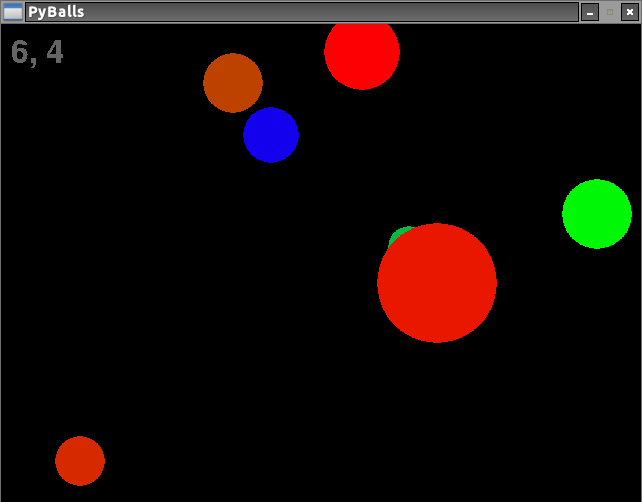

## PyBalls

PyBalls is a simple ball physics engine written in python.

### How to Run Game

From a terminal, `python pyballs.py`

### Controls

* WASD accelerated your ball around the universe
* N and M increase and decrease the radius of your ball
* P opens up the debugger if you want to inspect things. 

### Physics

Currently, balls attraction increases with the square of the radius and
decreases with the square of the distance between two balls. Two balls are only
attracted to eachother if they are in the same square. There is also a maximum
speed, which breaks conservation of momentum.
